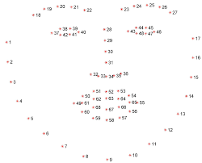

# Eye Strain Detector

It is common to feel eye strain while working with computers/laptops. The main cause of this eye strain is the lowered blinking rate of eyes while looking at screens. This project aims to track eye blinks of a person for possible build up of strain in the eyes. If the strain is detected then the person is notified to blink the eyes in order to lower it.

# Working

 The eye blinking detectiion is done with the help of dlib library. The dlib library is used to construct the facial landmark map       that highlights the important regions of the face.

 Then the points around the eyes are used to construct the a horizontal line and a vertical line across the eye.

 The ratio of this horizontal line and the vertical line is called Eye Aspect Ratio (EAR). EAR is used to detect the bliking of eyes. When the eyes blink lenght of vertical line decreases but the lenght of the horizontal line remains unchanged which leads to increase in EAR, hence the detection of blink.
 Once a blink is detected the time difference between the current blink and the previous blink is taken and is used to determine the strain buildup.
 
 # Running This Code
 
 Download or clone this repository on your local device and run the following command in the terminal while being in the Eye-blink-detection folder -  `python eyes.py`. If there's any package/module missing, you can easily install them using the `pip` command.
